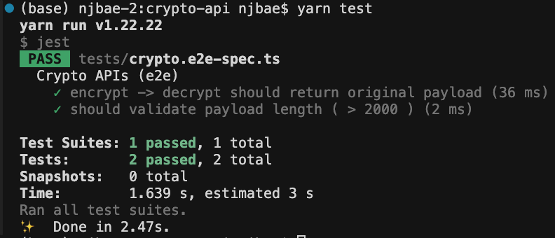

# Crypto API

## Prerequisites

- Node.js (v18+)

## Installation

### ใช้ Yarn

```bash
# ติดตั้ง dependencies
yarn install
```

### ใช้ npm

```bash
# ติดตั้ง dependencies
npm install
```

## RSA Keys Setup

1. สร้าง RSA keys จาก [https://cryptotools.net/rsagen](https://cryptotools.net/rsagen)

2. สร้างโฟลเดอร์ `keys` ใน root directory:

```bash
mkdir keys
```

3. วางไฟล์ keys:
   - `keys/private.pem` - RSA private key
   - `keys/public.pem` - RSA public key

4. ตั้งค่า environment variables:

```bash
# สร้างไฟล์ .env หรือ export environment variables
export RSA_PRIVATE_KEY_PATH=./keys/private.pem
export RSA_PUBLIC_KEY_PATH=./keys/public.pem
export PORT=3000
```

หรือสร้างไฟล์ `.env`:

```env
RSA_PRIVATE_KEY_PATH=./keys/private.pem
RSA_PUBLIC_KEY_PATH=./keys/public.pem
PORT=3000
```

## Running the Application

### Development Mode

**ใช้ Yarn:**

```bash
yarn start:dev
```

**ใช้ npm:**

```bash
npm run start:dev
```

### Production Mode

**ใช้ Yarn:**

```bash
# Build
yarn build

# Run
yarn start:prod
```

**ใช้ npm:**

```bash
# Build
npm run build

# Run
npm run start:prod
```

### Watch Mode

**ใช้ Yarn:**

```bash
yarn start:watch
```

**ใช้ npm:**

```bash
npm run start:watch
```

## API Documentation

เมื่อ server เริ่มทำงานแล้ว สามารถเข้าดู Swagger UI ได้ที่:

```
http://localhost:3000/api-docs
```

## Testing

### Unit Tests

**ใช้ Yarn:**

```bash
yarn test
```

**ใช้ npm:**

```bash
npm test
```

### E2E Tests

**ใช้ Yarn:**

```bash
yarn test:e2e
```

**ใช้ npm:**

```bash
npm run test:e2e
```

**Test Results:**



ตัวอย่างผลลัพธ์เมื่อรัน E2E tests:

- ✅ `encrypt -> decrypt should return original payload` - ทดสอบการ encrypt และ decrypt ข้อมูล
- ✅ `should validate payload length ( > 2000 )` - ทดสอบ validation ของ payload length

### Test Coverage

**ใช้ Yarn:**

```bash
yarn test:cov
```

**ใช้ npm:**

```bash
npm run test:cov
```

### Watch Mode

**ใช้ Yarn:**

```bash
yarn test:watch
```

**ใช้ npm:**

```bash
npm run test:watch
```

## License

UNLICENSED
